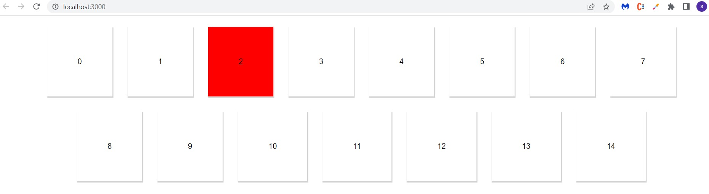

# React-Small-Projects - Swap Colors

### This project is the implementation of a concept called `Lifting the State UP` in react.

- I should create as many box/div/blocks as I want and I need to show them in linear fashion like a table's rows columns.
- When I will click on any box that needs to change it's background color to red (or anyone color).
- When I will click on any other box then initially clicked box should change to it's default color and the recently clicked box should change it's background color to red.
- So, basically at a time only one box, which has been clicked recently should be red, all other boxes should have their defalut color only.

### Solution image

