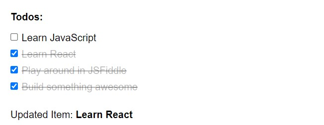

# To do List

- Implemented a To Do list, where number of tasks are shown with checkbox
- User can check on checkboxes then that task will be marked as completed and a line through will appear on it's text.
- If user unchecks any tasks, the task will be marked as not completed and line through will be removed from it's text.
- The most updated task is shown on bottom to highlight which task user is updating.

### Solution image

### Live Demo

You can check [Live Demo](https://jsfiddle.net/609yj1fh/83/).
